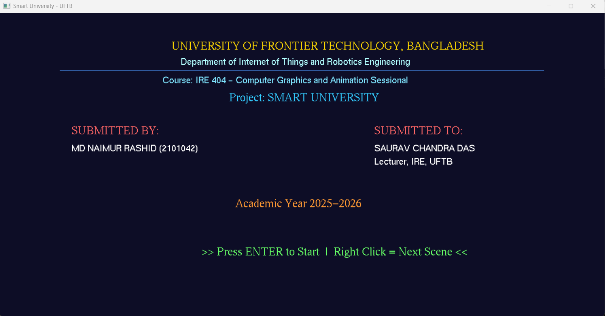
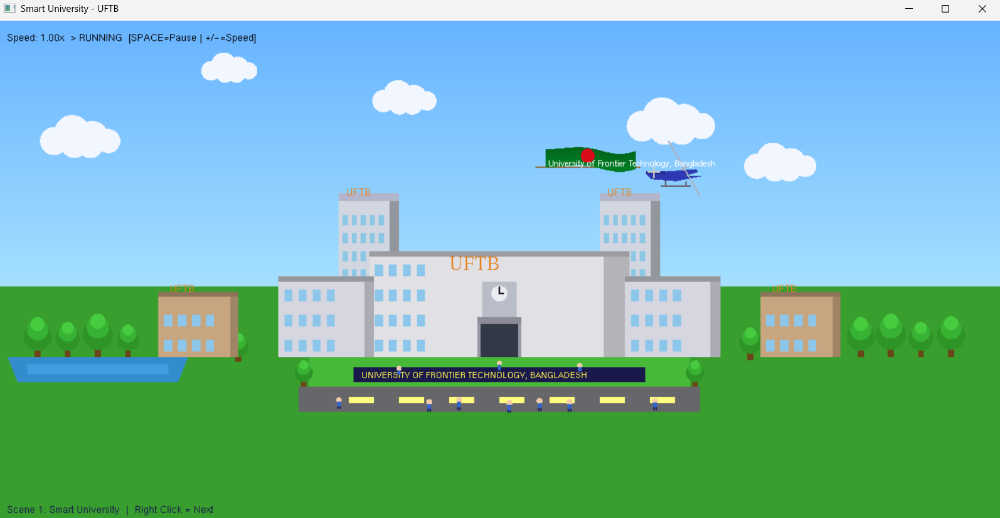
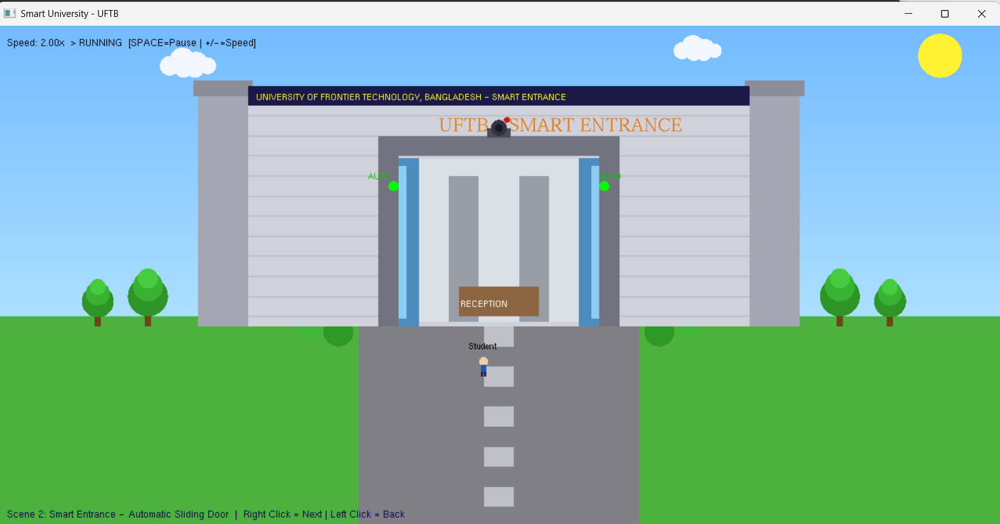
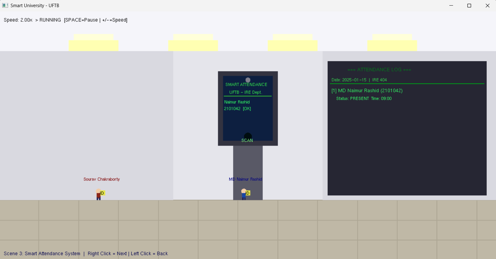
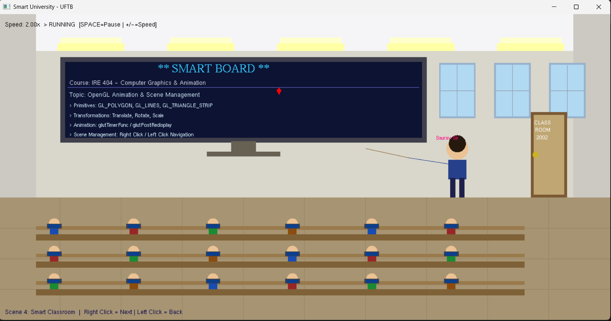
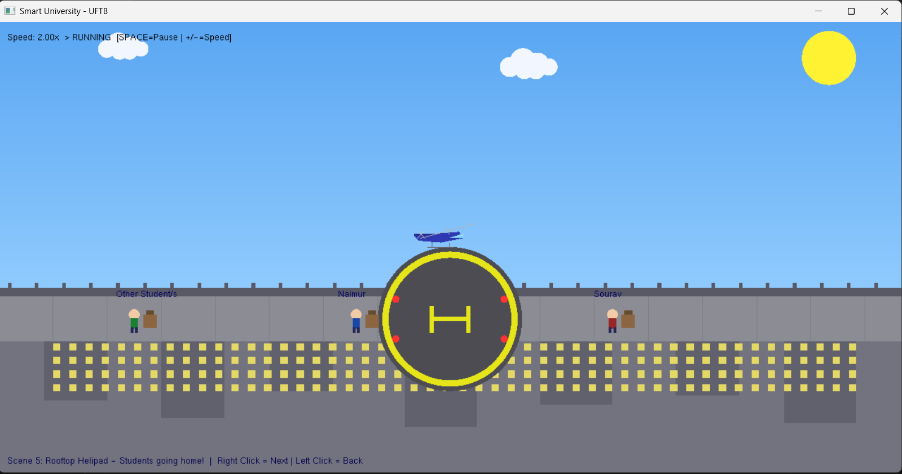
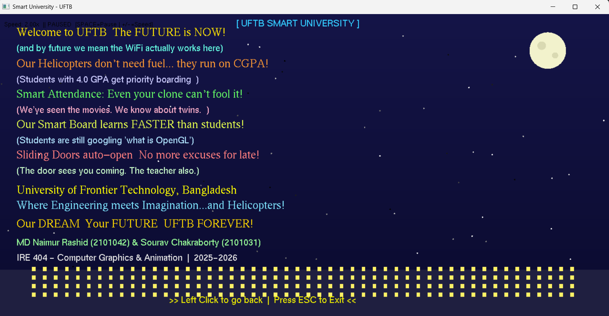

# 🎓 Smart University — UFTB
### An OpenGL/GLUT Computer Graphics & Animation Project

> **Course:** IRE 404 — Computer Graphics and Animation Sessional  
> **Department:** Internet of Things and Robotics Engineering  
> **University:** University of Frontier Technology, Bangladesh (UFTB)  
> **Academic Year:** 2025–2026

---

## 👥 Project Info

| Role | Name | ID |
|------|------|----|
| **Author** | MD Naimur Rashid | 2101042 |
| **Co-Author** | Sourav Chakraborty | 2101031 |
| **Supervisor** | Saurav Chandra Das | Lecturer, IRE, UFTB |

---

## 📸 Screenshots

| Scene | Preview |
|-------|---------|
| Intro Page |  |
| University Front |  |
| Smart Entrance |  |
| Smart Attendance |  |
| Smart Classroom |  |
| Smart Leave (Helipad) |  |
| Outro Page |  |

---

## 🗂️ Scene Navigation

| Scene | Title | Description |
|-------|-------|-------------|
| **Scene 0** | 🏫 Smart University | Main university view with animated helicopter, Bangladesh flag, clouds, sun, trees, people, lake, and road |
| **Scene 1** | 🚪 Smart Entrance | Close-up of entrance with automatic sliding door that opens when a student approaches (motion sensor) |
| **Scene 2** | 📋 Smart Attendance | Students (Naimur & Sourav) approach the kiosk one by one, scan ID, attendance is logged on screen |
| **Scene 3** | 🖥️ Smart Classroom | Classroom with students at benches, teacher pointing at Smart Board with live course content |
| **Scene 4** | 🚁 Rooftop Helipad | Helicopter lands on rooftop helipad, student boards, then helicopter takes off — repeats for each student |
| **Scene 5** | 🌙 Outro / Dream UFTB | Scrolling funny text about the dream smart university under a starry night sky |

---

## ✨ Features & Functions

### 🎬 Animation System
- `glutTimerFunc()` based ~60fps smooth animation loop
- `animSpeed` variable controls global animation speed (0.25x → 4.0x)
- `animPaused` boolean for pause/resume

### 🌤️ Environment
- **`drawSky()`** — Gradient sky background (blue tones)
- **`Sun_Model()`** — Slowly rotating glowing sun
- **`drawClouds()` / `cloud_model()`** — 5 clouds drifting at different speeds left→right
- **`drawGround()`** — Grass, road with yellow markings, front lawn, lake/pond

### 🏫 University
- **`drawUniversity()`** — Full university facade with 2 tall towers, central main building, wings, and side blocks
- **`drawTower()`** — Multi-floor tower with shadow side and windows
- **`drawBlock()`** — Horizontal academic block with floor-by-floor windows
- **`drawMainBuilding()`** — Central gate arch, clock tower, UFTB label, name board
- **`windowRow()`** — Helper to draw a row of windows on buildings
- **`treeAt()`** — 3-layer foliage tree at any position

### 🚁 Helicopter & Flag
- **`drawHelicopter(hx, hy, spinRate)`** — Animated helicopter with spinning main & tail rotors, cockpit glass, landing skids
- **`drawFlag(hx, hy)`** — Animated waving Bangladesh flag with TRIANGLE_STRIP wave math + red circle emblem + UFTB text

### 👥 People
- **`drawPerson(x, y, scale, r, g, b)`** — Stick-figure person with colored shirt, skin-tone head, legs
- **`drawPeople()`** — Places multiple people near entrance and on lawn

### 🚪 Scene 1 — Smart Entrance
- Motion sensor glow (green when student nearby)
- Auto sliding door (left & right panels slide apart)
- Lobby interior revealed as door opens (reception desk visible)
- CCTV camera with red indicator light
- Walking student animation with name tag

### 📋 Scene 2 — Smart Attendance
- Attendance kiosk with fingerprint scanner (pulsing glow)
- Students walk up one by one and scan
- Attendance log panel updates in real time
- "Successfully Entered!" message per student
- Auto-resets after both students are logged

### 🖥️ Scene 3 — Smart Classroom
- 3 rows of benches with 6 students each (laptop on desk)
- Teacher figure with pointer arm pointing at Smart Board
- Animated marker moving across the Smart Board
- Windows, ceiling lights, tiled floor, and classroom door

### 🚁 Scene 4 — Rooftop Helipad (Phase-based)
| Phase | Action |
|-------|--------|
| **0** | Helicopter flies in from left toward helipad |
| **1** | Helicopter lands (descends onto helipad) |
| **2** | Student walks to helicopter and boards |
| **3** | Helicopter takes off (ascends then flies right) |
- Repeats for each of the 3 students
- Boarded students disappear (no ghost bodies)
- Helipad with H marking, corner lights, city skyline below

### 🌙 Scene 5 — Dream University Outro
- Starry night background with blinking stars
- Moon with crater details
- University silhouette at bottom with glowing windows
- Scrolling funny English text about UFTB
- Blinking "press ESC to exit" message

---

## ⌨️ Controls

| Key / Action | Function |
|---|---|
| `ENTER` | Start the project from intro screen |
| `Right Click` | Go to next scene |
| `Left Click` | Go to previous scene |
| `SPACE` | Pause / Resume animation |
| `+` | Increase animation speed (+0.5x, max 4x) |
| `-` | Decrease animation speed (-0.25x, min 0.25x) |
| `R` | Reset animation speed to 1x |
| `ESC` | Exit the program |

---

## 🛠️ Build & Run

### Requirements
- Windows OS
- Code::Blocks IDE (or any GCC-based compiler)
- OpenGL, GLU, GLUT libraries

### Compile (Code::Blocks)
Open `SmartUniversity.cbp` and press **Build & Run (F9)**.

### Compile (Manual g++)
```bash
g++ main.cpp -o SmartUniversity -lopengl32 -lglu32 -lglut32
```

### File Structure
```
SmartUniversity/
├── main.cpp                  # Main source code
├── SmartUniversity.cbp       # Code::Blocks project file
├── SmartUniversity.depend
├── SmartUniversity.layout
├── bin/Debug/
│   └── SmartUniversity.exe   # Compiled executable
├── obj/Debug/
│   └── main.o
└── Screenshots/
    ├── intro-page.png
    ├── university-front.png
    ├── smart-entarance.png
    ├── smart-attendence-system.png
    ├── smart-classroom.png
    ├── smart-leave.png
    └── outro-page.png
```

---

## 🧰 Tech Stack

| Technology | Usage |
|---|---|
| **C++** | Core programming language |
| **OpenGL (GL)** | 2D rendering primitives |
| **GLU** | Utility functions (ortho projection) |
| **GLUT** | Window management, input, timer |
| **GNU GCC** | Compiler |
| **Code::Blocks** | IDE |

---

## 📐 Key OpenGL Concepts Used

- `GL_POLYGON`, `GL_LINES`, `GL_TRIANGLE_STRIP` — Shape primitives
- `glTranslatef`, `glRotatef`, `glScalef` — Transformations
- `glPushMatrix` / `glPopMatrix` — Matrix stack management
- `glutTimerFunc` — Timer-based animation (~60fps)
- `gluOrtho2D` — 2D orthographic projection
- `glutBitmapCharacter` / `glutStrokeCharacter` — Text rendering
- `glutMouseFunc` / `glutKeyboardFunc` — Input handling

---

## 📄 License

This project was developed for academic purposes as part of the IRE 404 coursework at UFTB. All rights reserved.

---

<div align="center">

**Made with ❤️ and OpenGL**

*University of Frontier Technology, Bangladesh*

*"Where Engineering meets Imagination... and Helicopters!"* 🚁

---

**Author: MD Naimur Rashid**

</div>
